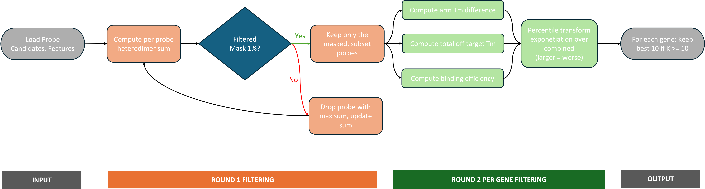
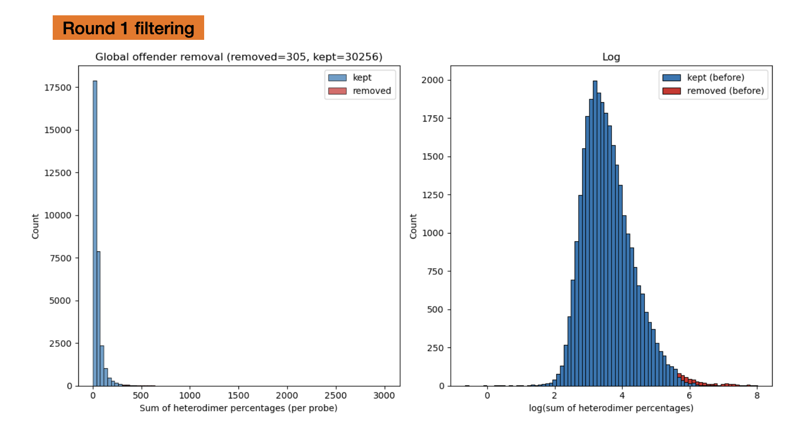
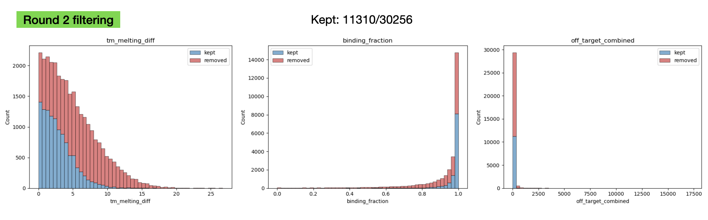

# Receptor Probe Filtering

A reproducible pipeline to rank and select padlock probes for odorant receptor targets, given a pool of candidate probes.

## Requirements
- Python >= 3.9
- Standard scientific stack: `numpy`, `pandas`, `matplotlib`, `scipy`

> ⚠️ Some inputs are large (e.g., a 7.5 GB heterodimer matrix pickle file). Make sure your machine has at least 16 GB RAM (>=32 GB recommended). Close other apps before loading large pickles.

## Data
All data live in the project Dropbox:
- **Dropbox folder:** `Odorant_Receptors/data_monohan_probe_filtering_2025/`

To run locally:
1. Copy the entire contents of `data_monohan_probe_filtering_2025/` into the repo as a folder named **`data/`**.
2. Expect large files.


## Filter algorithm 


See <a href="algo.pdf" target="_blank">algo.pdf</a> for details.

## Filtering results

#### Global:


#### Per-gene feature filtering:


- Number of kept probes in worst 10% for rank_off_target_combined: 0.77%
- Number of kept probes in worst 10% for rank_tm_melting_diff: 0.25%
- Number of kept probes in worst 10% for rank_binding_fraction: 0.30%

#### Output:
```
filtered_probe_set_all_latest-date.csv # all input probe candidate with metrics
filtered_probe_set_kept_latest-date.csv # kept probes only
less_than_10_porbes_latest-date.csv # list of genes with less than 10 probes 
```