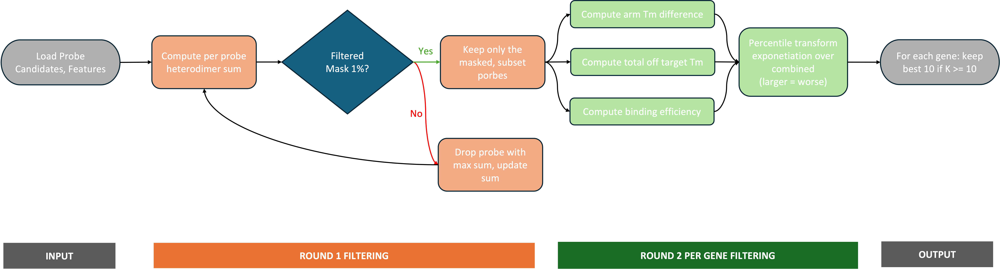
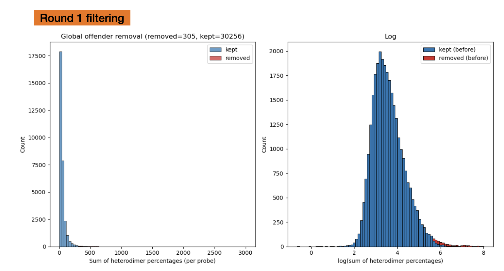
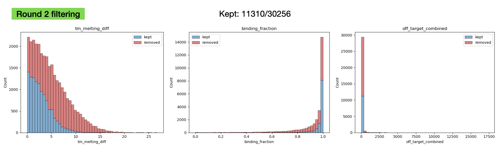

# Receptor Probe Filtering

A reproducible pipeline to rank and select padlock probes for odorant receptor targets, given a pool of candidate probes.

## Requirements
- Python >= 3.9
- Standard scientific stack: `numpy`, `pandas`, `matplotlib`, `scipy`

> ⚠️ Some inputs are large (e.g., a 7.5 GB heterodimer matrix pickle file). Make sure your machine has at least 16 GB RAM (>=32 GB recommended). Close other apps before loading large pickles.

## Installation
You can install all the required dependencies automatically into a new environment by using conda:

    conda env create -f environment.yml

Then select the `probe-filtering` kernel when starting the jupyter notebook `filtering_all.ipynb`

## Data
All data live in the project Dropbox:
- **Dropbox folder:** `Odorant_Receptors/data_monohan_probe_filtering_2025/`

To run locally:
1. Copy the entire contents of `data_monohan_probe_filtering_2025/` into the repo as a folder named **`data/`**.
2. Expect large files.


## Filter algorithm 


See <a href="algo.pdf" target="_blank">algo.pdf</a> for details.

## Filtering results

#### Global:


#### Per-gene feature filtering:


- Number of kept probes in worst 10% for rank_off_target_combined: 0.93%
- Number of kept probes in worst 10% for rank_tm_melting_diff: 0.31%
- Number of kept probes in worst 10% for rank_binding_fraction: 0.39%

#### Output:
```
filtered_probe_set_all_latest-date.csv # all input probe candidate with metrics
filtered_probe_set_kept_latest-date.csv # kept probes only
less_than_10_porbes_latest-date.csv # list of genes with less than 10 probes 
```

- OR/Taars we have designed probes for: 1148
- Total number of probe candidates kept: 11244
- OR/Taars that have 10+ probes: 1074
- OR/Taars that have less than 10 probes: 74

#### Processes specific to this particular design run (documented in the notebook)

1. Pre-filtering with a conservative `melting5` model:
We used a more conservative `melting5` temperature calculation to remove probes with high-affinity off-target binding. In the future, if `melting5` becomes part of the probe-pool generation pipeline, this pre-filtering step can be skipped.

2. Redesigning barcodes for Olfr1111 and Olfr657:
After identifying that the existing barcodes for Olfr1111 and Olfr657 were driving heterodimer formation with many other probes, we redesigned their barcodes and recomputed all secondary-structure-related features. The final probe set reflects these updated barcode designs for the two genes. This iteration might still be needed in the future design process.